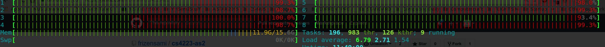
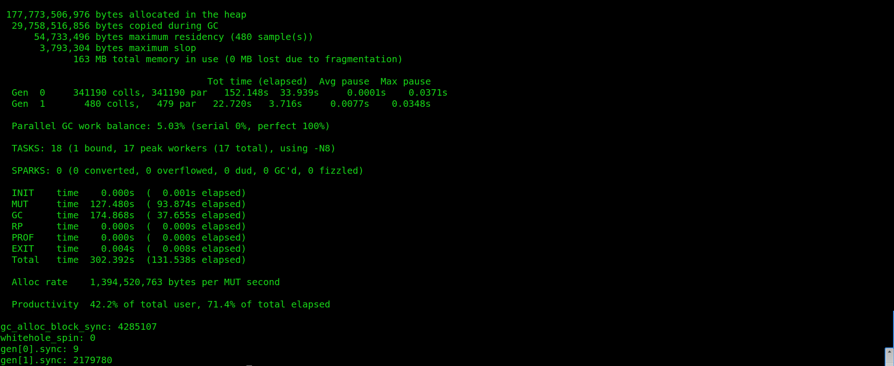
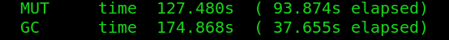
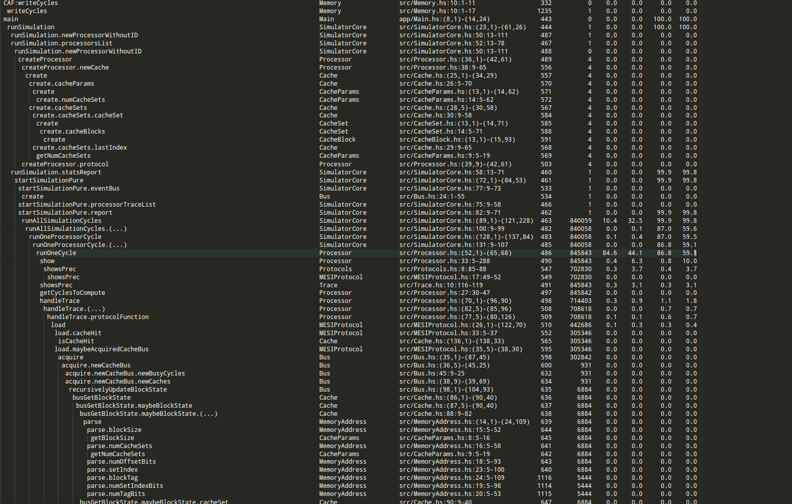
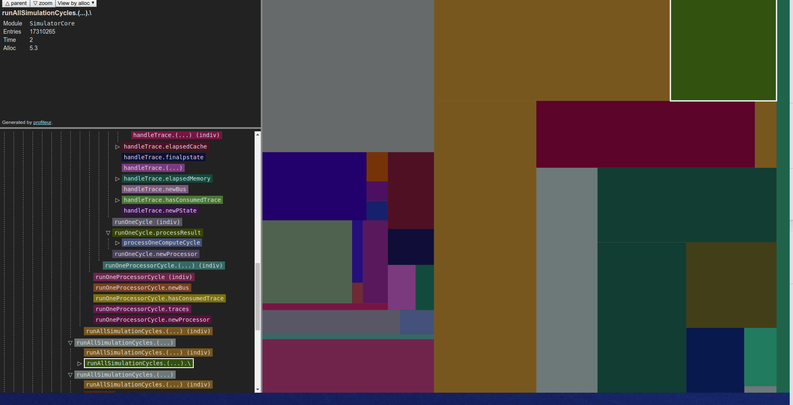
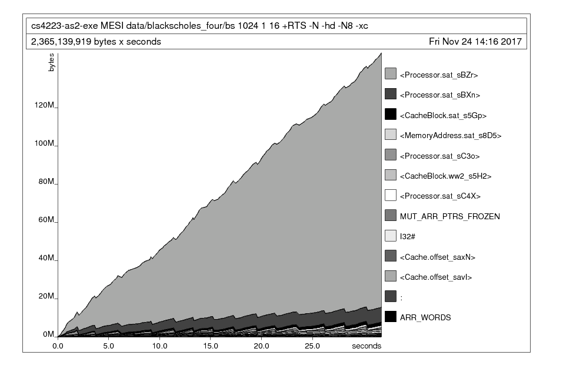
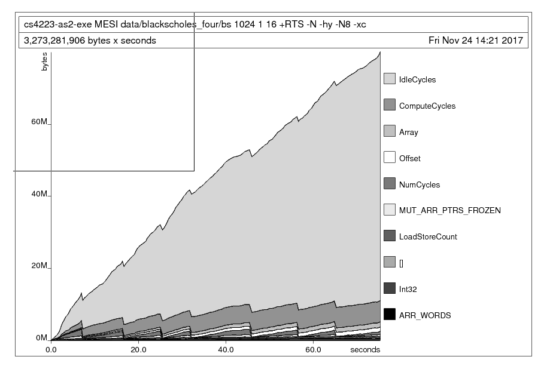

# A methodology to diagnose and solve performance problems in your Haskell programs 
## Introduction
My first two projects in Haskell were [a multi-core cache coherence protocol simulator](https://github.com/frizensami/cs4223-as2) and a a solver for the game [Boggle](https://en.wikipedia.org/wiki/Boggle) (still being optimized!). I kept running into performance problems like:
- Space leaks
- Ridiculous space leaks (eating up all my RAM and swap)
- Excessively long runtime - A boggle game is 1 minute, runtime for the solver was 2 minutes!

I gave up on optimizing my first project, the Boggle solver, for a while. I began optimizing my Haskell projects once I worked on the simulator, since that was a project for a university module and I had to make it work somehow. 

Here is a methodology that worked for me.

## Reference Material
- [The Haskell Wiki on performance](https://wiki.haskell.org/Performance)
- [Will Sewell's great series of posts on optimizing Haskell programs - Part I](https://making.pusher.com/top-tips-and-tools-for-optimising-haskell/)
- [The GHC Profiling Guide](https://downloads.haskell.org/~ghc/latest/docs/html/users_guide/profiling.html)

## Methodology
### Step 0: What problem does your program have?
Identify the **rough issue** your program is facing. On Ubuntu, I run my Haskell program first, then execute
```bash
$ htop
```
to get a rough idea of how my CPU and memory are being utilized. You can use your preferred system monitoring tool (Task Manager for windows, or just `top`, etc) to get similar results.



In my case, all of my cores were being utilized quite heavily by my executing Haskell program, and the dangerous indicator here is that my memory usage ("Mem" in the image) kept rising past the current usage levels to near 15GB, where I would run out of RAM - and the program was still running!

This was a classic space leak - my program did not need to continually allocate more memory because the size of the data it was working on did not increase, and the final output was not proportional to the runtime.

### Step 1: Enable GHC Options
This will likely get you an immediate speedup and in certain cases where the compiler can identify certain optimizations, the space leaks might disappear too. 

Try adding
```bash
-funfolding-use-threshold=16 -O2 -optc-O3
```

I added this in the `ghc-options` portion of my `.cabal` file (I'm using `stack`). 

After this step - go back to `htop` or your system monitor and see if anything has changed. In my case, the program was not significantly faster, nor did it solve my space leaks. If this is the case, more rigorous **profiling** is necessary.

### Step 2: Enable profiling with your builds

If you're using `stack`, you can add certain options to your `stack build` command, e.g.:

```bash
stack build --executable-profiling --library-profiling
```

If you're using other build tools or `ghc` directly, have a look at the list of references to see how to enable profiling. Also note that profiling may slow down your program - if you're looking for the best execution time after you're done optimizing, turn these and the runtime options off.

### Step 3: Run in an initial profiling mode: GC vs Program time ratio
After we have compiled in profiling mode, we can run the program in **many** different profiling modes to get the data we want. 

This attemps to answer the question: are we spending a significant amount of time garbage collecting over doing useful work?

```bash
stack exec <program name and arguments>  -- +RTS -sstderr -N8 -xc -RTS
```
Going through each of these options: 
- `+RTS` and `-RTS` enclose the region with runtime system options. 
- `-sstderr` is the option that enables garbage colletion statistics.
- `-N8` enables running on all 8 cores of my machine - you may want to decrease that number. 
- `-xc` will give us a stack trace on error.

This will output something like this:



Out of this data, we are mostly interested in 3 numbers: 
- MUT time (time spent on productive work) - **127 seconds**
- GC time (time spent fully on garbage collection) - **174 seconds**
- Productivity - **42.2%**




These are numbers after some optimizations were done - my initial productivity was less than **20%**! This is a good indicator that the garbage collection being done to the detriment of the rest of the computation. 


### Step 4: Where is the garbage?
Now we need to identify where the garbage collector is working the most. We first need to generate a `.prof` file with data about where the program is spending most of its time, and where most memory allocations happen.

```bash
stack exec <program and arguments>  -- +RTS -p -N8 -xc -RTS
```
The only new argument here is `-p` which outputs data about the "cost-centres" of your Haskell program - an **area of code that is held responsible for time and space allocations**.  These are automatically set by the compiler but you can manually annotate some suspicious areas as well.



Even with the indentatation, this is a bit hard to parse. 

I installed `profiteur` to make the output prettier:
```bash
stack install profiteur
```
a program that can transform profiling output from `.prof` files into `.html` which can be viewed interactively in a browser.

I also created a simple shell script to run profiteur and display the results in Google Chrome:

```bash
profiteur <program name>.prof && google-chrome <program name>.prof.html
```

This finally gave me output that I could interactively click through:



In Profiteur, you can select whether you want to sort the cost-centres by the overall proportion of **time** taken to execute it or the amount of **space** allocated within in. The size of the box on the screen indicates the proportion relative to other cost centres.

Attempt to optimize the **problematic functions first** - this gives the best return on time investment when trying to settle performance issues as I found out.

### Step 5: Gathering more intel with `-hd`
Profiteur gave me an idea of where the problem areas in my code were, but nothing that I didn't expect (most of my problems were in the large main loop). I went on to use other profiling methods to find more precise problem areas.

We want a **time-based** graph of memory usage that updates dynamically. This is possible to get with GHC's wonderful tooling and some other programs. 

You're going to need `Ghostview (gv)` (tool that was installed with my Ubuntu system), and `hp2ps` (should be installed with stack).  Prepare a shell script like this (which I called `live_heap.sh`) ([referenced from here](https://downloads.haskell.org/~ghc/latest/docs/html/users_guide/profiling.html#viewing-a-heap-profile-in-real-time)):
```bash
#!/bin/sh
# live_heap.sh
head -`fgrep -n END_SAMPLE <your-program-name>.hp | tail -1 | cut -d : -f 1` <your-program-name>.hp \
  | hp2ps > <your-program-name>.ps
gv --orientation=seascape <your-program-name>.ps &
gvpsnum=$!
while [ 1 ] ; do
  sleep 10
  head -`fgrep -n END_SAMPLE <your-program-name>.hp | tail -1 | cut -d : -f 1` <your-program-name>.hp \
    | hp2ps > <your-program-name>.ps
  kill -HUP $gvpsnum
done
```

(Note: sometimes the `hp2ps` to `gv` pipeline doesn't work (it didn't work for my `-h` option)). You can also use `hp2pretty` (serves a similar purpose as `hp2ps` but outputs a `.svg` file instead) by `stack install`ing it and using `watch` to keep looking at the `.svg` file that it outputs.)

Now run your program with the `-hd` option to begin populating a `.hp` file of the **memory usage over time broken down by closure description**. 
```bash
stack exec <program and arguments>  -- +RTS -hd -N8 -xc -RTS
```

Finally, run `live_heap.sh` (or whatever you called it) to begin viewing your graph live!



It was clear that a certain `Processor` instance of mine was eating up all my memory. 

### Step 6: Gathering even more intel with the -hy option
Now we can break down the graph again by **type** - this gives the most targeted information about which data type is giving us the most trouble.
```bash
stack exec <program and arguments>  -- +RTS -hd -N8 -xc -RTS
```

Run `live_heap.sh`



This made it abundantly clear that the memory leak was mainly due to my `IdleCycles` data type!

### Step 7: Fix the problem!
There were two main things that worked for me.

#### Resolving built-up thunks with strictness annotations
In my case, a data structure was constantly changing on every simulated "cycle" of my program. One of the main culprits (as seen above) was a data object called `IdleCycles` that was tracking an integer statistic by incrementing it every cycle. 

Because I only access `IdleCycles` at the end of the program, many lazy thunks of addition were accumulating: `idle + 1 = (oldidle + 1) + 1 = ((oldidle' + 1) + 1) + 1...`

I enabled GHC's `BangPatterns` extension and began to annotate functions that mutated the `IdleCycle` type with **strictness annotatations** (the `!` symbol) to force the thunks to be evaluated. This technique applied to many other data types solved a large proportion of the problem.

```haskell
addOneStatsIdleCycle :: ProcessorStatistics -> ProcessorStatistics
addOneStatsIdleCycle (ProcessorStatistics compute loadstore !idle misscount pid) = ProcessorStatistics compute loadstore (idle + 1) misscount pid
```
#### Considering different data structures
The simulator used a large data structure (Haskell's Data.Array) of many nested sub-structures (some lists, some more Data.Array-s). Every cycle, as some of this structure was modified and the rest were not accessed, a lot of copying had to be done and a lot of lazy evaluation was occuring with built up thunks. Our stopgap solution was to change to `Data.Array.Unboxed`, a drop in solution for our use case since our storage type was `Int32` - and we suddenly had less overhead in time and space. Other options for improving this data structure could have been `Data.Array.DiffArray`, `Vector`, or `STArray/STUArray`, perhaps even `IOArray`. 

I recommend very carefully choosing your backing data structure and consider the monad you intend to work in if you want to use mutable arrays. 

### Step 8: Try more profiling ideas, then go to step 7
Repeat steps 3 - 7 until all of those problems are resolved! If performance problems still exist, do try looking at the reference material to try more profiling options.  


## Conclusion
Hopefully some of these ideas have worked for you as they did for me. I will update this as I come across more techniques to optimize Haskell programs in the future. In the meantime - do drop a PR if you want something else added!


